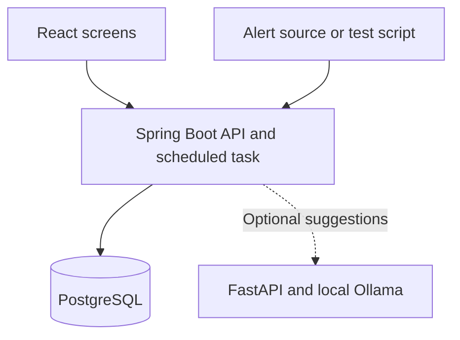

# Project Structure and Design

## 1. High-level design: how the parts fit together

React provides the screens. Spring Boot handles permissions and incident rules. PostgreSQL stores the records. A scheduled task inside Spring Boot checks escalation deadlines. Start with one backend instance.

The backend is the authority for status changes, timing, and permissions. Browser validation helps the user, but the backend checks every request again. The optional AI service receives selected context from the backend and does not write to the database.

## 2. Repository layout

| Path | Contents |
| --- | --- |
| `backend/` | Spring Boot application and Java tests |
| `backend/src/main/resources/db/migration/` | Flyway database migrations |
| `frontend/` | React screens, components, and frontend tests |
| `docs/` | These design documents, actual elicitation evidence, and sprint notes |
| `.github/workflows/` | Build and test workflow |
| `compose.yaml` | Local database and application setup |
| `.env.example` | Example settings without real credentials |
| `ai-service/` | Add only when starting the AI extension |

Inside the backend, use packages such as `auth`, `catalog`, `incident`, `alert`, `notification`, and `postmortem`. Keep SLA and escalation classes with the incident feature initially. Split a package only when its size makes that useful.

Each feature can contain its controller, request/response DTOs, service, entity, and repository. Controllers receive requests; services apply rules; repositories read and write records. Do not return JPA entities directly as API responses. We do not need an interface for every service class.

## 3. Main screens and API operations

| Screen | Main operations |
| --- | --- |
| Login | Sign in and sign out |
| Services and on-call | View services; Admin edits configuration and on-call slots |
| Incident board | List and filter incidents by status, service, and severity |
| Incident detail | Acknowledge, assign, change status, comment, and read the timeline |
| History and postmortem | Search older incidents; read fixes; edit postmortems and action items |
| Notifications | View and mark personal notifications as read |

Use REST endpoints under `/api`. Examples are `GET/POST /api/incidents`, `POST /api/incidents/{id}/acknowledge`, `POST /api/incidents/{id}/transitions`, and `POST /api/alerts`. Define exact fields in OpenAPI as each feature is built. Use separate endpoints for status, assignment, and severity changes so their rules stay clear.

## 4. Low-level design: main records

This is a starting data model, not a complete migration script. Use foreign keys and validate required fields.

| Record | Important fields |
| --- | --- |
| User | ID, name, login, password hash, role |
| Team and membership | Team ID, name; user-to-team membership |
| Service | ID, name, owner team, fallback user |
| SLA target | Service, severity, response minutes, resolution minutes |
| On-call slot | Service, responder, start time, end time |
| Escalation step | Service, step number, responder, waiting minutes |
| Incident | ID, service, title, description, severity, status, assignee, creator, timestamps, copied SLA targets, version |
| Alert | Source, event ID, correlation key, incident ID, received time, validated payload fingerprint |
| Timeline entry | ID, incident, actor, event type, details, time, optional corrected-entry ID |
| Escalation task | Incident, copied steps, current step, next due time, state |
| Notification | Recipient, incident, message, creation time, read time |
| Postmortem | Incident, summary, known cause or unknown, fix, lessons |
| Action item | Postmortem, description, owner, completion state |
| Audit entry | Actor, configuration change, time |

Store timestamps in UTC. `@Version` on Incident detects competing changes. Use a unique constraint on `(source, event_id)` to prevent duplicate alert delivery. Configure each usable service with SLA targets, a fallback contact, and an escalation policy before accepting incidents for it.

## 5. Main classes

| Class | Responsibility |
| --- | --- |
| `IncidentService` | Create, acknowledge, assign, change severity, and change status |
| `TransitionPolicy` | Check allowed status transitions |
| `SlaCalculator` | Calculate elapsed time and whether targets were exceeded |
| `AlertService` | Authenticate and validate events, check duplicates, create or link alerts |
| `OnCallService` | Select the responder for a service and time |
| `EscalationService` | Check persisted deadlines and advance unanswered incidents |
| `NotificationService` | Create and read in-app notifications |
| `PostmortemService` | Save postmortems and action items |

Inject a `Clock` into timing code so tests can control time. Keep the transition and timing rules as ordinary Java methods that can be unit-tested and mutation-tested.

## 6. Create and group incidents

For a manual report, validate the service and required fields, select its current on-call responder or fallback, and create an OPEN incident. Save its SLA targets, initial timeline entry, notification, and escalation task in the same database transaction.

For an incoming alert:

1. Verify the configured source signature and validate the payload. Reject invalid requests.
2. Check the source and event ID. A retry with the same content returns the existing result; the same ID with changed content is rejected.
3. If an explicit correlation key matches an active incident for that source and service, attach the alert to it.
4. Otherwise create an incident using the same creation flow as a manual report.

Active means neither RESOLVED nor CLOSED. A recurrence after resolution creates a new incident. Without a correlation key, different events create separate incidents. Matching service names or similar text is not enough to merge them. Separate incidents can still concern related services; we defer automatic cross-service grouping.

Keep the duplicate check and grouping operation in a transaction. For this small application, alert intake can briefly lock the service row before checking and creating a matching incident. This prevents two simultaneous alerts from creating two incidents for the same key. Keep the event uniqueness constraint as a final safeguard.

## 7. Acknowledgement and escalation

Acknowledgement changes OPEN to ACKNOWLEDGED, makes the accepted acknowledger the assignee, records that person and time, stops the response clock, and cancels pending acknowledgement escalation. Any authorized Engineer or Admin may acknowledge an OPEN incident, even if they are not the current assignee. It does not stop the resolution clock.

A scheduled task checks stored due times. Before escalating, it checks again that the incident is OPEN and unacknowledged. It then notifies the next contact, writes a timeline entry, and stores the next deadline. Escalation does not change the assignee; the escalation task records which contact has been notified. The initial responder receives the first configured waiting period; later steps name the next contacts and their waiting periods. After the final unanswered step, notify the fallback once and mark the escalation task exhausted. The incident remains OPEN and can still be acknowledged.

For example, if A is assigned and escalation notifies B, A stays assigned until an acknowledgement succeeds. If A acknowledges first, A owns the response; if B acknowledges first, ownership moves to B. After acknowledgement, changing the owner requires an explicit reassignment.

Acknowledgement and escalation must both update the incident version. Escalation must explicitly force a version increment even though it only changes notification/task records, so an acknowledgement race can still roll back the losing transaction. Status, severity, and manual assignment changes also use the incident version. Their incident, task, timeline, and notification changes must commit together. If a version conflict occurs, roll back the whole operation and re-read the incident; the scheduled task must never blindly retry an old escalation decision. A stale user command returns a conflict and asks the screen to refresh.

If escalation commits just before acknowledgement, its notification may already exist. Acknowledgement stops later escalation; it cannot retract a notification already seen. After a restart, process an overdue step once, then allow the next responder their full configured waiting period.

Comments and amendments are separate timeline inserts. They do not require an expected Incident version or update the Incident row, including its last-updated field. Persist them through the timeline repository without mutating a parent-owned collection that increments the incident version. Two authorized users can therefore comment at the same time without overwriting or rejecting each other. Give entries their own IDs and sort by recorded time and ID for stable display; this is not a strict commit-order guarantee. Comments remain allowed on CLOSED incidents as follow-up notes and do not reopen them.

## 8. Status and SLA rules

Normal path:

`OPEN → ACKNOWLEDGED → INVESTIGATING → IDENTIFIED → MONITORING → RESOLVED → CLOSED`

Also allow INVESTIGATING → MONITORING when recovery can be checked without a confirmed cause, and MONITORING → INVESTIGATING when the problem continues. Reject other transitions in the first version. Do not invent a root cause to move forward.

Both SLA clocks start at incident creation. The response clock ends at the first accepted acknowledgement; the resolution clock ends at RESOLVED. Compare elapsed continuous time with the copied target. Exceeding the target is a breach; reaching it exactly is not yet a breach.

Targets stay fixed for that incident even if severity or service settings change later. Severity changes affect displayed priority and are recorded with a reason. Adding alerts, assigning another responder, or returning to investigation does not restart either clock. No pauses, business calendars, or reopening are included initially.

RESOLVED requires a recovery note. CLOSED requires the basic postmortem to be saved and reviewed by an Engineer or Admin. Action items may remain open after closure. These are proposed simple rules to confirm during elicitation.

## 9. Access and history

For this single-organization prototype, authenticated users can read shared incident records. Viewers cannot change them. Engineers and Admins can respond to incidents and edit postmortems. Only Admins change users, service settings, on-call slots, and escalation policies. Personal notifications are visible only to their recipient.

Use Spring Security session authentication, password hashing, and CSRF protection for browser requests. The alert endpoint uses separate source authentication. Keep secrets out of Git and logs.

Status, ownership, severity, and comment events are append-only through the application. Correct an entry by adding an attributed amendment. Configuration changes receive audit entries. This is an application rule, not a claim that a database administrator cannot alter the database.

## 10. Optional AI extension

Start with one useful feature: retrieve previous incidents and ask a local model to suggest investigation steps from their fixes. Show the referenced incident IDs and label the result as a suggestion. A similar past incident does not prove the same cause.

Limit the context, validate structured output, and apply a timeout. If the model fails, users can still search history and continue manually. AI does not change status, calculate SLA, or execute commands. Use a stub in CI. Add a larger agent workflow only if the simple feature is working and the team has time.
